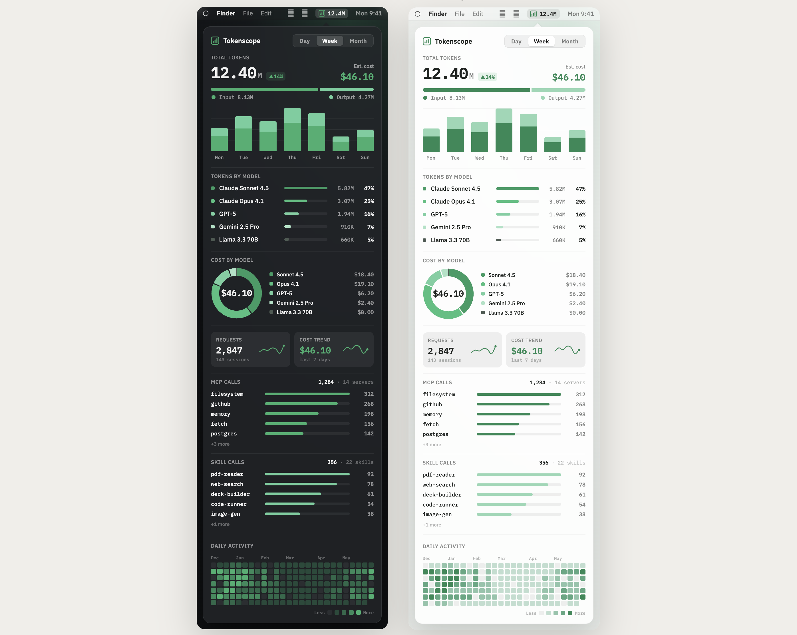

# Tokenscope

**English** · [中文](README-zh.md)

Codex fork of [HduSy/tokenscope](https://github.com/HduSy/tokenscope).

A **menu-bar / system-tray app for macOS and Windows** that shows your Codex **daily token usage, estimated cost, and per-model / tool / Skill call breakdown**.

Stack: **Tauri 2 + React + TypeScript** (frontend) / **Rust** (data layer).



## What it does

- Shows today's token count next to the menu-bar icon (e.g. `⬡ 14.00M`)
- Click to open the panel: Day / Week / Month toggle
- Metrics: total tokens (input/output), estimated cost, requests / sessions
- Three breakdowns: **by model** / **by tool call** / **by Skill call**
- Cost donut (hover for a single model), year-long activity heatmap
- Reads Codex session logs from `~/.codex/sessions/**/*.jsonl` and archived sessions from `~/.codex/archived_sessions/*.jsonl`

## Data sources (zero-intrusion, read-only)

| Purpose | Path |
|---------|------|
| Codex session logs (tokens / tool calls) | `~/.codex/sessions/**/*.jsonl` |
| Codex archived logs | `~/.codex/archived_sessions/*.jsonl` |
| Claude logs (still supported) | `~/.claude/projects/**/*.jsonl` |
| User Skill whitelist | `~/.codex/skills/` and `~/.claude/skills/` directories |
| Model prices | **Primary**: [models.dev](https://models.dev/api.json) → **Fallback**: [LiteLLM](https://raw.githubusercontent.com/BerriAI/litellm/main/model_prices_and_context_window.json) → built-in snapshot. Cached in `~/Library/Caches/tokenscope/`, refreshed every 24h, with offline fallback |

### Key processing
- Deduplicated by `message.id` (streaming/retries repeat the same usage); when one message spans multiple lines, its tool calls are merged and the token usage is counted once
- Token split: `input` (uncached) / `cache` (creation+read) / `output`; the UI folds cache into "In" by default and shows a separate "cached %"
- Price matching: exact id → normalized id (strip vendor prefix + `.`↔`p`, e.g. `glm-5.1`⇄`glm-5p1`); models.dev's official bare-name price wins
- Cost is priced per the four token types; each model carries a `priced` flag — **models not found in either source still count tokens but are labelled "no price" in the UI**
- Logs contain only the bare model name (no vendor) → third-party models default to the official vendor price (an estimate)
- Codex token events use `last_token_usage`: cached input is split out from total input, output is counted once, and reasoning tokens are treated as part of output because Codex reports them as a subset.
- Tool classification: Codex `response_item` calls are counted by tool name; Claude `mcp__<server>__*` calls remain supported.

> Cost is an **estimate** based on public prices; subscription users should read it as "equivalent spend value".

### Token types & cost formula

Claude assistant messages report four **mutually exclusive** token counts (they never double-count the same token); Codex token events report cached input as a subset of input, and Tokenscope splits it into the same display buckets:

| Stage | `usage` field | What it is | Price (relative to input) |
|-------|---------------|------------|---------------------------|
| **Input** (uncached) | `input_tokens` | New prompt tokens sent this turn | 1× |
| **Cache write** | `cache_creation_input_tokens` | Context written into the prompt cache | ~1.25× |
| **Cache read** (hit) | `cache_read_input_tokens` | Context replayed from the cache | ~0.1× (much cheaper) |
| **Output** | `output_tokens` | Tokens the model generated | ~5× |

**Tokens** (per period, summed over messages):

```
total  = input + cache_creation + cache_read + output
# the UI shows:  In = input + cache_creation + cache_read,  Out = output,  cached % = cache_read / total
```

**Cost** (each stage priced at its own per-token rate from the price table):

```
cost = input            × price.input
     + cache_creation   × price.cache_creation
     + cache_read       × price.cache_read     # cache hits billed at the discounted read rate
     + output           × price.output
```

So a cache hit is **not** billed as normal input — it uses the dedicated (cheaper) `cache_read` rate, which is why heavily-cached usage shows a huge token count but a modest cost. The UI folds cache into "In" for display only; billing always uses the four separate rates above.

## Install

### Option 1: Homebrew (recommended)

```bash
brew install --cask yuanxiong-wang/tokenscope/tokenscope
```

The cask's `postflight` strips the quarantine attribute (`xattr -cr`) automatically, so **it opens on first launch without the "Apple cannot verify" prompt**.

After you open it once it registers as a login item, then **launches in the menu bar automatically on every boot**.

Upgrade:

```bash
brew update && brew upgrade --cask tokenscope
```

### Option 2: Download the .dmg

1. Download the latest `Tokenscope_*_universal.dmg` from [Releases](https://github.com/yuanxiong-wang/tokenscope/releases) (works on both Apple Silicon and Intel)
2. Drag it into Applications
3. Because the build is **unsigned / unnotarized**, Gatekeeper blocks the first launch — pick one:
   - Right-click the app → **Open** → confirm **Open** again, or
   - Run once in the terminal:
     ```bash
     xattr -cr /Applications/Tokenscope.app && open /Applications/Tokenscope.app
     ```

> Unsigned is a current known limitation. A true "double-click to open" experience requires Apple Developer ID signing + notarization — see `PRD.md` §6.4.

### Option 3: Install on Windows

1. Download the latest `Tokenscope_*_x64-setup.exe` from [Releases](https://github.com/yuanxiong-wang/tokenscope/releases)
2. Double-click to install. Because the build is **unsigned**, Windows SmartScreen will warn on first run — click **More info → Run anyway**
3. The app installs per-user (no admin required) and registers itself for **launch at login** automatically
4. Requirements: **Windows 10 1803+ / Windows 11** with the WebView2 runtime (preinstalled on Windows 11; Windows 10 users without it will be prompted by the installer)

### After first launch

- **macOS**: an icon plus today's token count appears in the menu bar (e.g. `⬡ 12.40M`)
- **Windows**: the tray icon appears in the notification area. The Windows tray API doesn't show a label beside the icon — **hover the tray icon** to see today's token count in the tooltip (e.g. `Tokenscope · today 12.40M`)
- Left-click the icon to toggle the panel; right-click for the menu (Open / Refresh / Quit)
- **Launch-at-login is set up automatically** — no manual configuration needed

## Develop

```bash
pnpm install
pnpm tauri dev         # launch the desktop app (requires the Rust toolchain)
```

Frontend-only preview (using the real-data snapshot `public/dev-dashboard.json`):

```bash
pnpm dev               # http://localhost:1420
# refresh the snapshot:
cd src-tauri && cargo run --example dump > ../public/dev-dashboard.json
```

## Build

```bash
pnpm tauri build       # outputs .app / .dmg on macOS, .exe (NSIS) on Windows to src-tauri/target/release/bundle/
```

For distribution see `PRD.md` §6.3 (Homebrew Cask recommended on macOS; direct `.dmg` / `.exe` downloads benefit from code signing + notarization).

## Structure

```
src/                  React frontend
  data.ts             types + Tauri bridge + theme + formatting
  charts.tsx          chart primitives (bars / donut / sparkline / heatmap / segmented control)
  App.tsx             main panel
src-tauri/src/
  store.rs            incremental Claude/Codex JSONL ingest
  parser.rs           aggregation (Day/Week/Month + heatmap)
  pricing.rs          models.dev / LiteLLM price loading and costing
  config.rs           user MCP / Skill whitelist
  model.rs            data structures returned to the frontend
  lib.rs              Tauri commands + menu-bar tray
```

## Bug log

Notable bugs found during development — symptom, root cause, and fix — are
collected in [docs/BUGFIXES.md](docs/BUGFIXES.md).
